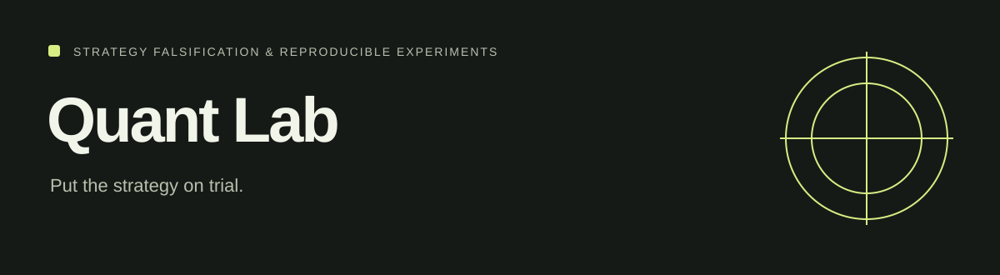

# Quant Lab

<!-- repo-badges:start -->
<div align="center">

[](https://github.com/honeyamn10-source/Quant_Lab/stargazers)
[](https://github.com/honeyamn10-source/Quant_Lab/forks)
[](https://github.com/honeyamn10-source/Quant_Lab/issues)
[](https://github.com/honeyamn10-source/Quant_Lab/commits/main)

[Repository](https://github.com/honeyamn10-source/Quant_Lab) · [Issues](https://github.com/honeyamn10-source/Quant_Lab/issues) · [Pull Requests](https://github.com/honeyamn10-source/Quant_Lab/pulls) · [Actions](https://github.com/honeyamn10-source/Quant_Lab/actions)

</div>
<!-- repo-badges:end -->


A Python research platform for testing assumptions about market data, execution and strategy robustness.

[Project website](https://honeyamn10-source.github.io/Quant_Lab/) · [Build results](https://github.com/honeyamn10-source/Quant_Lab/actions)

## What it does

- **Generate evidence.** Use synthetic markets and point-in-time data tools.
- **Challenge assumptions.** Run backtests, validation and execution-cost experiments.
- **Keep the record.** Experiment ledgers and generated reports preserve results for reproduction.

> Research software. Statistical checks expose some failure modes; they do not guarantee unbiased models or profitable strategies. Read the methodology before interpreting results.

## Features

- **Synthetic markets with known ground truth** — random walk, trend, mean
  reversion, volatility clustering, regime switch, structural break, jump,
  cointegrated pairs.
- **Point-in-time data model** — strategies see a guarded `BarStream`; future
  data is inaccessible by construction.
- **Event-driven backtester** — market/limit/stop orders, partial fills,
  rejections, commissions, financing, configurable execution delay.
- **Statistical falsification** — PSR, Deflated Sharpe Ratio, PBO, purged CV,
  walk-forward, bootstrap, Monte Carlo.
- **Execution reality** — cost model with four profiles and capacity estimation.
- **Adversarial lab** — parameter, timing, cost and universe perturbation with a
  robustness rating.
- **Regimes & volatility** — rule-based/GMM/HMM/ensemble; historical, EWMA, HAR,
  realized, GARCH/EGARCH/GJR.
- **Sizing** — fixed fraction, vol targeting, Kelly, CVaR, robust sizing.
- **Experiment ledger & graveyard** — immutable records, failures included.
- **CLI, reports & API** — reproducible commands, HTML reports, FastAPI dashboard.

## Requirements

Python **3.12+**. Core deps are minimal (`numpy`, `pydantic`, `PyYAML`);
heavier frameworks are optional extras.

## Installation

```bash
pip install "."
pip install -e ".[dev]"       # dev: pytest, ruff, mypy, build
pip install -e ".[ml]"        # scipy, scikit-learn, statsmodels, arch, optuna
pip install -e ".[tracking]"  # mlflow
pip install -e ".[storage]"   # pandas, polars, duckdb, pyarrow
pip install -e ".[web]"       # fastapi, uvicorn, jinja2, plotly
```

## Quick start

```bash
# 1. Generate a synthetic market with known ground truth
quantlab data generate-synthetic --out datasets/ --seed 7 --symbols SYN

# 2. Audit and score it
quantlab data audit --file datasets/SYN.json
quantlab data quality --file datasets/SYN.json

# 3. Run a benchmark strategy
quantlab backtest examples/strategies/sma_crossover.yaml

# 4. Full experiment: backtest + validation + ledger + report
quantlab run-experiment examples/strategies/sma_crossover.yaml

# 5. Reproduce it later from the ledger alone
quantlab reproduce EXP-0001
```

## Commands

| Command | Purpose |
| --- | --- |
| `data generate-synthetic` | Generate a synthetic market series |
| `data audit` / `data quality` | Point-in-time audit / quality score |
| `backtest CONFIG.yaml` | Run a config and print metrics |
| `run-experiment CONFIG.yaml` | Backtest + validation + ledger + report |
| `validate RESULTS.json` | Run the validation battery on results |
| `stress EXPERIMENT_ID` | Adversarial perturbation + robustness rating |
| `regimes FILE.json` | Regime decomposition |
| `volatility FILE.json` | Benchmark volatility models |
| `report EXPERIMENT_ID` | Write the HTML validation report |
| `graveyard list` | List recorded failed experiments |
| `reproduce EXPERIMENT_ID` | Re-run an experiment from its ledger record |
| `sizing [--simulate]` | Position-sizing quick checks |

## Configuration

Run configs are YAML files consumed by `backtest`, `run-experiment`, `stress`
and `reproduce`. See `examples/strategies/*.yaml`:

```yaml
name: sma_crossover_on_random_walk
strategy: sma_crossover
strategy_params:
  fast: 10
  slow: 30
data:
  symbols: ["SYN"]
  process: random_walk
  n_bars: 504
  seed: 7
initial_cash: 1000000.0
execution_delay: 1
execution_mode: next_open
profile: normal
commission_bps: 5.0
```

Strategies: `breakout`, `buy_and_hold`, `mean_reversion`, `mean_reversion_rsi`,
`momentum`, `pairs`, `random`, `sma_crossover`, `vol_target`.

## Project layout

```text
quantlab/            Python package (engine, validation, execution, regimes...)
datasets/            Raw / research datasets (gitignored)
docs/                Documentation
examples/            Strategy configs
benchmarks/          Benchmark comparisons
tests/               unit / integration / statistical / lookahead / synthetic
experiments/         Experiment outputs (gitignored)
```

## Development

```bash
make lint            # ruff
make format          # ruff check --fix + ruff format
make typecheck       # mypy
make test            # full pytest suite
make test-lookahead  # pytest -m lookahead
make cov             # coverage report
make build           # sdist + wheel
```

See [`docs/architecture.md`](docs/architecture.md),
[`docs/methodology.md`](docs/methodology.md) and the other files in
[`docs/`](docs/).

## Contributing

Read [`CONTRIBUTING.md`](CONTRIBUTING.md). Failed experiments are permanent
evidence — no results-deletion PRs. Keep `make lint` + `make typecheck` green.
Behaviour is governed by [`CODE_OF_CONDUCT.md`](CODE_OF_CONDUCT.md); report
security issues privately per [`SECURITY.md`](SECURITY.md).

## License

MIT — see [`LICENSE`](LICENSE).
